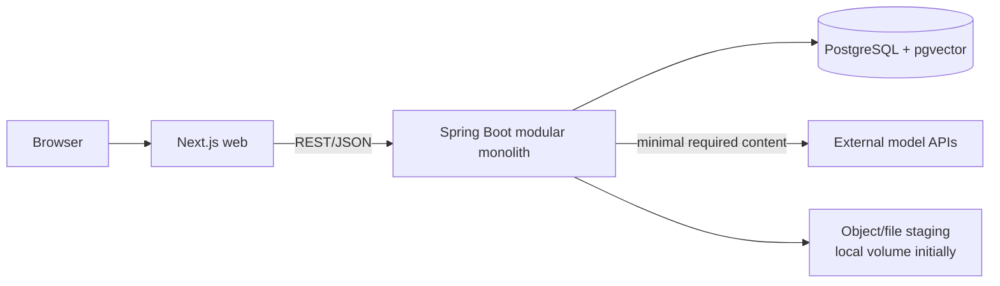

# Software architecture

## Architectural drivers

Optimize for one AI-assisted developer, rapid vertical slices, low cost, privacy, evidence integrity, and a future hosted offering. The MVP is a **modular monolith** with one PostgreSQL database and database-backed workers. Maven is chosen over Gradle because its declarative lifecycle, wrapper, dependency convergence tooling, and conventional Spring layout give humans and coding agents fewer build-language choices.

## System context



Next.js is a presentation/BFF-free client for the MVP; authorization and domain rules live in Spring. Upload bodies may pass directly to Spring. PostgreSQL is the system of record for normalized content, assertions, temporal relations, jobs, full-text indexes, and vectors. Uploaded archives are deleted after processing by default; long-term raw-archive retention is opt-in.

## Backend style and dependency rules

Each module contains `domain`, `application`, and `adapter` packages as needed. Domain code is plain Java. Public application ports/DTOs form module APIs; internal repositories and provider SDK types are not exported. Synchronous calls are used when a caller needs an immediate result; committed domain events trigger projections/jobs.

```mermaid
flowchart TD
  user --> conversation
  user --> ingestion
  ingestion --> conversation
  ingestion --> provider
  extraction --> conversation
  extraction --> provider
  extraction --> entity
  entity --> conversation
  graph --> entity
  project --> entity
  project --> conversation
  memory --> entity
  memory --> conversation
  retrieval --> memory
  retrieval --> project
  retrieval --> graph
  retrieval --> conversation
  retrieval --> provider
  shared -.technical primitives only.-> ingestion
```

Arrows mean “may depend on.” `graph` and `project` consume entity/extraction facts rather than calling each other. Retrieval composes their read APIs. Events must not create hidden circular command flows.

## Modules

| Module | Responsibility and entities | Public interfaces | Depends on | Emits | Consumes |
|---|---|---|---|---|---|
| `user` | Users, workspaces, membership/ownership, provider credentials | `WorkspaceAccess`, `CredentialVault` | `shared` | `WorkspaceDeletionRequested` | — |
| `ingestion` | Import batch/file lifecycle, adapter selection, normalization jobs | `ImportService`, `ConversationImportAdapter` | `user`, `conversation`, `provider`, `shared` | `ConversationImported`, `ConversationNormalized`, `ImportCompleted` | workspace deletion |
| `conversation` | Provider-independent conversations/messages and source identity | `ConversationCatalog`, `MessageEvidenceReader` | `user`, `shared` | `ConversationStored` | workspace deletion |
| `provider` | Model/embedding clients, routing, credentials, usage metadata; no domain truth | `StructuredGenerationPort`, `EmbeddingPort`, `AnswerGenerationPort` | `user`, `shared` | `ProviderCallRecorded` | — |
| `extraction` | Runs, immutable results, schemas/prompts, chunking and validation | `ExtractionScheduler`, `ExtractionResultReader` | `conversation`, `provider`, `shared` | `ExtractionCompleted`, `EntityDetected`, typed assertion detection events | `ConversationNormalized` |
| `entity` | Canonical entities, aliases, candidate matches, merge/reversal, assertions/evidence ownership | `EntityCatalog`, `ResolutionService`, `AssertionReader` | `conversation`, `shared` | `EntityMerged`, `EntitySplit`, `TopicDetected`, `ProjectDetected`, `DecisionDetected` | extraction detection events |
| `graph` | Temporal typed entity relations and graph read projection | `GraphQuery`, `RelationWriter` | `entity`, `shared` | `GraphUpdated` | entity/merge/assertion events |
| `project` | Project goal/state history, milestone/task/decision/question projections and explainable progress | `ProjectQuery`, `ProjectStateReconciler` | `entity`, `conversation`, `shared` | `ProjectStateChanged`, `ProjectProjectionUpdated` | project/assertion/merge events |
| `memory` | Typed memory items, lifecycle, salience and embeddings | `MemoryCatalog`, `MemorySearch` | `entity`, `conversation`, `provider`, `shared` | `MemoryUpserted`, `EmbeddingRequested` | extraction/entity/project events |
| `retrieval` | Query planning, hybrid candidates, ranking, evidence packet, grounded answer | `ContextQueryService`, `SearchService` | read interfaces of conversation/entity/graph/project/memory; provider | `ContextQueryAnswered` (audit metadata only) | — |
| `shared` | IDs, clock, pagination, domain-event/outbox primitives, errors; no business entities | small technical types | — | — | — |

`topics` and `projects` are typed canonical entities but projects additionally have a dedicated state projection. Evidence is owned with assertions in `entity` to avoid a cyclic “provenance module”; all modules use its evidence-writing contract.

## Processing pipelines

```mermaid
sequenceDiagram
  participant I as Ingestion worker
  participant C as Conversation
  participant E as Extraction worker
  participant R as Entity resolution
  participant G as Graph projector
  participant P as Project projector
  I->>C: idempotent normalized conversation/messages
  C-->>E: ConversationNormalized (outbox)
  E->>E: chunk, structured generate, validate
  E-->>R: immutable detections + evidence
  R->>R: canonicalize or create review candidate
  R-->>G: entity/assertion events
  R-->>P: project/assertion events
  G->>G: append/close temporal relations
  P->>P: append state; rebuild current projection
```

### Jobs and transactions

- API writes domain data and an `outbox_events` row in one transaction.
- A polling dispatcher claims rows with `FOR UPDATE SKIP LOCKED`, publishes Spring application events after commit, and marks dispatch status.
- Durable work lives in `background_jobs`, with type, JSON payload, deduplication key, attempts, lease, next attempt, and dead-letter status.
- Handlers are idempotent. In-process Spring events are notification mechanics, not durability.
- Projection updates use the source event ID as an idempotency key.

This is intentionally more reliable than bare `@Async` without adding Kafka. Later, the outbox can feed a broker and high-volume workers can be split along existing module ports.

## Frontend architecture

`apps/web` uses Next.js App Router, TypeScript, React Server Components for initial read pages where practical, and client components for uploads/graph interaction. A generated or hand-maintained thin API client maps server DTOs; domain logic is not duplicated in the browser. Suggested feature folders are `imports`, `conversations`, `projects`, `graph`, `search`, and `context-query`.

Use React Flow initially: it supports controlled nodes/edges and custom evidence-aware entity cards with less graph-specific API surface than Cytoscape. The API supplies bounded subgraphs; never load the full workspace graph. Accessibility requires a list/table alternative to the canvas.

## Internal event envelope

Every event has `eventId`, `eventType`, `schemaVersion`, `workspaceId`, `aggregateType`, `aggregateId`, `occurredAt`, `correlationId`, and a minimal payload. Never put raw conversations in events. Initial events include:

- `ConversationImported`, `ConversationNormalized`, `ExtractionCompleted`
- `EntityDetected`, `EntityMerged`, `EntitySplit`
- `TopicDetected`, `ProjectDetected`, `DecisionDetected`
- `ProjectStateChanged`, `GraphUpdated`

Events describe committed facts. Commands requesting expensive work are durable jobs, not misleading past-tense events.

## Provider abstraction

Separate capabilities because not every provider/model supports all of them:

```java
public interface StructuredGenerationPort {
  StructuredGeneration generate(StructuredGenerationRequest request);
}
public interface EmbeddingPort {
  List<Embedding> embed(EmbeddingBatch request);
}
public interface AnswerGenerationPort {
  GeneratedAnswer answer(GroundedAnswerRequest request);
}
```

Requests contain provider-neutral messages, model policy/cost tier, schema identifier + JSON Schema, timeout, and idempotency/correlation metadata. Results include parsed values or typed failures, usage, model identity, finish reason, and provider request ID. Adapters translate OpenAI/Anthropic/etc. Domain modules select a capability and policy, never a vendor model name. Streaming chat can be a later interface rather than contaminating extraction.

## Deployment

MVP Compose runs `web`, `server`, and a pgvector-enabled PostgreSQL image. The server process can execute both HTTP and worker roles; a profile permits a second identical worker process if needed. TLS terminates at a simple reverse proxy/hosting platform. Cloudflare may host/proxy the frontend later but is not required by backend contracts.

## Security and privacy

- TLS in transit; encrypted database/storage volumes in hosted deployment.
- Credentials encrypted at application level using a master key supplied outside the database; never returned after creation or logged. BYOK is workspace-scoped.
- Log IDs, timings, sizes, hashes, and error categories—not prompts, message bodies, answer bodies, or keys.
- Enforce `workspace_id` in every aggregate/query; repository APIs require workspace context. Add cross-workspace integration tests. Consider PostgreSQL RLS as defense-in-depth after query patterns stabilize.
- Minimize provider disclosure: send only selected chunks/evidence; show which provider is used; support redaction and future local adapters.
- Export includes normalized content, derived state, and provenance in documented JSON. Deletion cascades/queues embeddings and staged objects, with auditable completion but no retained sensitive payload.
- Validate upload type/size, zip paths and expansion ratio; rate-limit expensive endpoints; sanitize rendered Markdown.

## Cost controls

- **Local/SQL first:** hashes, parsing, exact aliasing, full-text search, state projection.
- **Cheap/background:** batched embeddings, classification, summary, structured extraction, metadata.
- **Capable/on demand:** ambiguous entity reconciliation and final grounded answers.
- Hash `(source content, extractor, prompt, schema, model policy)` to skip unchanged work; batch within token limits; cache embeddings and retrieval plans where safe.
- Record tokens and estimated cost per provider call/run; impose workspace budgets and job backpressure.

## Evolution without a rewrite

First scale PostgreSQL indexes, bounded queries, worker concurrency, and read projections. Then separate web/worker processes. If job throughput warrants it, publish the transactional outbox to a managed queue. Partition embeddings or use a specialist vector store only after measured pgvector limits. Introduce a graph database only for proven traversal needs; module interfaces already isolate graph reads. Split a module into a service only when ownership/scale/reliability demands outweigh operational cost.
