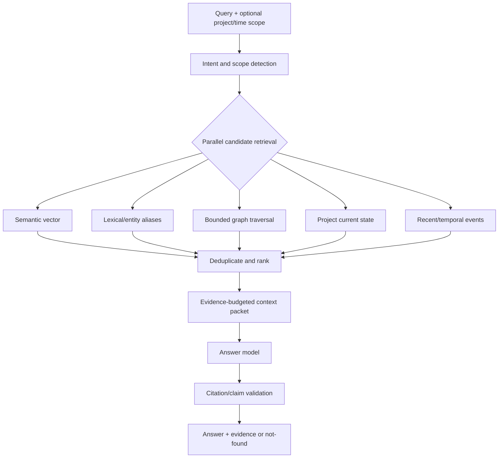

# Context engine

## Purpose and invariants

The context engine turns immutable normalized conversations into revisable interpretations and deterministic current projections:

```text
conversation → extraction → entity resolution → temporal reconciliation
             → graph update → project-state update → retrieval
```

Its key invariants are: source messages stay immutable; probabilistic output is versioned; uncertain identity is not destructively merged; history is append/close; important state requires evidence; current state can be rebuilt; and an LLM never computes project completion.

## 1. Normalize conversations

An import adapter maps provider-specific records into `NormalizedConversation` and ordered `NormalizedMessage` values. It preserves source IDs, provider timestamps, roles, reply parents, and unknown safe metadata. Canonical content hashing normalizes only representation details (for example line endings), not meaningful text. `(workspace, provider, external ID)` and hashes make retries idempotent.

Generic JSON v1 is a documented envelope containing conversations and messages. The ChatGPT adapter traverses conversation mapping/tree structure into deterministic branches and order; unsupported parts become warnings. Normalization is separate from extraction so new provider adapters cannot change domain logic.

## 2. Extract strict structured context

### Chunking

Prefer a complete conversation if it fits the configured budget. Otherwise split on message boundaries with small overlap, stable chunk IDs, and message IDs embedded as reference labels. Never cut UTF-8/JSON blindly. A later conversation-level consolidation job reconciles chunk results.

### Contract

The extractor requests provider-native structured output constrained by versioned JSON Schema. A result resembles:

```json
{
  "schemaVersion": "context-extraction/1",
  "entities": [{
    "localId": "e1", "type": "PROJECT", "name": "ContextMesh",
    "aliases": ["context graph project"], "confidence": 0.96,
    "evidence": [{"messageId": "m42", "start": 18, "end": 29}]
  }],
  "assertions": [{
    "type": "DECISION", "subjectLocalId": "e1",
    "value": {"text": "Use PostgreSQL for the MVP"},
    "status": "ACCEPTED", "effectiveAt": "2026-08-10T12:00:00Z",
    "confidence": 0.93,
    "evidence": [{"messageId": "m42", "start": 75, "end": 101}]
  }],
  "relations": []
}
```

Allowed enums and relation endpoints are schema constrained. The application then validates message ownership, offsets, required evidence, timestamp bounds, referential integrity, maximum lengths/counts, and semantic rules. One constrained repair attempt may be made; otherwise the run fails visibly and is retryable. Parsed results and the validated original payload are immutable.

### Version and cost identity

An extraction fingerprint includes source content hash, chunker/extractor code version, prompt version, schema version, provider/model policy, and relevant settings. An existing successful fingerprint is reused. New versions create new runs/results; old results and evidence remain. Selective reprocessing filters by old version, failure, conversation/project, or source change.

Cheap models handle routine extraction and summaries. Exact/lexical candidate generation precedes any LLM reconciliation. A capable model is invoked only for valuable ambiguous cases and cannot directly merge records.

## 3. Resolve entities conservatively

Resolution is a staged pipeline:

1. Normalize alias for candidate generation (case/spacing/punctuation; preserve original).
2. Retrieve candidates by exact alias, trigram name, shared project/topic neighborhood, and optionally embedding similarity.
3. Score explainable features: type compatibility, name/alias similarity, temporal overlap, shared technologies/organizations, contradictory attributes, and source diversity.
4. Auto-link only above a calibrated high threshold with no hard conflict.
5. Create a pending candidate in the ambiguous band; create a new entity below it.
6. Optional model adjudication produces a recommendation and rationale, not an irreversible mutation.
7. Manual accept/reject is durable training/evaluation data.

An accepted merge records absorbed/surviving IDs. Source detections, assertions, and evidence keep original references. Canonical lookup follows the active merge mapping; graph/project projections rebuild. Reversal closes the merge record and replays affected projections. Confidence is shown to users and thresholds are versioned.

## 4. Reconcile temporal truth

Extraction says what a source appears to claim; reconciliation decides how it affects history.

- Additive facts/tasks can coexist.
- Exclusive decisions in the same subject/aspect may supersede earlier accepted decisions.
- Explicit language (“we switched from X to Y”) is stronger than mere later mention.
- Contradiction without clear replacement marks claims `CONTESTED`; it does not silently close either.
- Task/milestone completion requires explicit evidence or accepted manual action.
- Late-arriving conversations are inserted by effective/source time and the projection is replayed.

Rules run deterministically over typed assertions. An LLM may classify whether two decisions concern the same aspect, but the application performs interval closing, `SUPERSEDES` linking, and projection updates transactionally.

## 5. Update graph and project state

The graph contains canonical entities and typed temporal relations, never a node per message. Messages remain evidence. Project/topic/entity detections and assertion references produce bounded edges such as `PART_OF`, `USES`, `DEPENDS_ON`, `SUPPORTS`, `CONTRADICTS`, and `SUPERSEDES`. Unsupported generic `RELATED_TO` is used sparingly.

Project state is inferred from explicit evidence-backed signals under versioned deterministic rules. Examples: accepted goal but no planning evidence → `IDEA`/`EXPLORING`; accepted plan/milestones → `PLANNING`; active implementation tasks/milestone events → `BUILDING`; explicit validation work → `VALIDATING`; explicit pause/completion/abandonment → corresponding state. Ambiguous evidence creates a suggestion rather than changing state. Every transition appends history and identifies its cause.

Progress returns milestone counts with numerator/denominator item IDs and evidence. Suggested, cancelled, superseded, or invalid milestones are excluded and reported separately. No milestones means “not available.”

## Worked temporal example

| Source time | Conversation evidence | Interpretation | State/history effect |
|---|---|---|---|
| Jul 15 | “I want a cross-model context graph.” | Project candidate “ContextMesh”; goal assertion | Project `IDEA`; alias retained. |
| Aug 2 | “Maybe PostgreSQL or Neo4j.” | Open question/options, not a decision | Graph links both technologies as considered; no current DB decision. |
| Aug 10 | “Use PostgreSQL + pgvector for the MVP.” | Accepted database decision | PostgreSQL decision valid from Aug 10; question resolved; `USES` edge created. |
| Aug 20 | “The generic importer is complete; now building ChatGPT import.” | Milestone completion and active task | Project moves to `BUILDING`; progress is 1/accepted milestones if denominator exists. |
| Sep 5 | “Neo4j might help after scale, but not for MVP.” | Future consideration, confirms scope | PostgreSQL remains current MVP decision; Neo4j is a future topic, not contradiction. |
| Oct 1 | “At scale we replaced pgvector graph traversal with Neo4j.” | Explicit superseding decision (future release scope) | PostgreSQL decision closes for that aspect/time; both remain on timeline with `SUPERSEDES`. |

If the October conversation is imported before August's, `observed_at` and effective time still reconstruct the same history. Selecting any timeline row reveals its message, provider, timestamp, offsets, run, prompt/schema/model identity, and confidence.

## Memory model

These are retrieval views, not separate sources of truth. Initially they are computed from messages, assertions, entities, relations, and append-only project history. ContextMesh must not copy assertions into an independently authoritative memory store. Phase 6 may materialize rebuildable retrieval units only after Ask My Context demonstrates a concrete performance or ranking need; every unit must retain provenance to its source.


### Working memory

Ephemeral context for the current UI query/conversation: user request, scope, selected entities, and recent turns. Kept in request/session storage with strict token limits; it is not automatically promoted.

### Episodic memory

Evidence-backed events in time: a decision occurred, milestone completed, state changed. It links assertions/events to messages and is ordered by observed/effective time.

### Semantic memory

Relatively stable facts and concepts: canonical entities, descriptions, aliases, facts, and relationships. “Stable” means currently valid and sufficiently supported, not immutable.

### Project memory

A project-focused projection of goal, decisions, milestones, tasks, questions, state history, related topics, and recent conversations. It references assertions rather than copying truth.

Messages supply evidence; entities supply identity; the graph supplies relationships; embeddings supply candidate similarity, not truth. Inclusion in a memory view requires validation and provenance. Reconciliation closes underlying assertion or relation validity while history remains available to the episodic view.

## Retrieval and answering



Intent detection first uses rules/entities (question words, known aliases, explicit scope); a cheap model handles ambiguity. A database-decision question gives structured current accepted decisions the strongest prior. Candidate scores combine source relevance, entity match, current-vs-historical intent, confidence, evidence quality, recency, and diversity. Scores are logged without sensitive text for evaluation.

Context composition groups canonical facts, includes history only when relevant, and attaches compact evidence excerpts with opaque citation IDs. Per-source and total token budgets prevent a long conversation from crowding out other evidence. The answer model is instructed to use only supplied material, distinguish current from historical claims, and cite IDs. Post-validation rejects unknown citations and either removes unsupported sentences or returns uncertainty. The API resolves citation IDs to message deep links.

No query sends all transcripts. Provider calls receive the minimum selected text. Retrieval results are reproducible through a retrieval version, and feedback can be evaluated against evidence selections rather than model eloquence alone.
