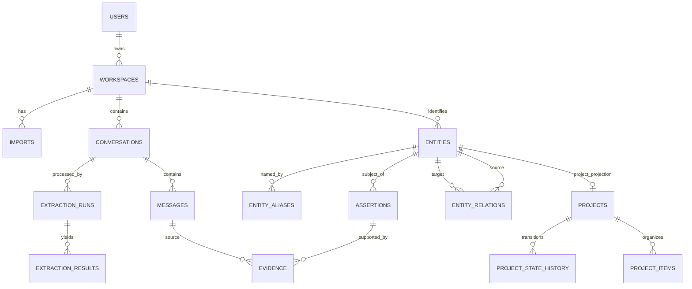

# Data model

## Principles

PostgreSQL is the source of truth. UUIDv7 (or application-generated time-sortable UUIDs) are primary keys. Every user-owned row carries `workspace_id`; uniqueness is scoped by it. Timestamps are UTC `timestamptz`. Original normalized messages and extraction results are immutable except for deletion. Derived “current” projections are rebuildable from versioned assertions and history.

Rather than separate tables for every extracted type, canonical concepts use `entities` and claims use `assertions`; projects receive dedicated operational projections because their lifecycle and queries are richer. This prevents a dozen nearly identical evidence/link tables while retaining typed constraints in application code and check constraints. It trades some database-level subtype strictness for a smaller evolvable schema.

## Conceptual model

## Core tables

All foreign keys use matching `workspace_id` through composite unique constraints where feasible, preventing accidental cross-tenant references. Default deletion is restrictive; the workspace deletion service performs ordered hard deletion.

| Table | Purpose and important columns | Indexes / keys | Lifecycle |
|---|---|---|---|
| `users` | Account: `id`, normalized email, display name, `created_at`, `deleted_at` | PK `id`; unique lower(email) for active users | Soft-disable for login; hard/anonymize with workspace deletion policy. |
| `workspaces` | Isolation/ownership: `id`, `owner_user_id`, name, settings JSON, timestamps | PK; index owner | Soft-delete while deletion job runs, then hard-delete. |
| `provider_credentials` | Encrypted BYOK secret, provider, key version, label, last-used | PK; unique workspace/provider/label; FK workspace | Ciphertext only; hard-delete; rotate by inserting/updating encrypted value. |
| `imports` | Upload job/report: adapter, original filename, content hash, status, counts, errors JSON, timestamps | PK; index workspace/status/created; optional unique workspace/adapter/hash | Mutable state machine; raw staging locator cleared after completion. |
| `conversations` | Normalized header: provider, external ID, title, source created/updated, content hash, import ID, metadata JSON | PK; unique workspace/provider/external_id when present; workspace/source-created, GIN title search | Immutable source identity/body references; re-import updates linkage only if content changes via new revision policy. |
| `messages` | Ordered normalized record: conversation, external ID, ordinal, role, text content, source timestamp, parent message, content hash, metadata | PK; unique conversation/ordinal; unique provider ID when present; indexes conversation/ordinal, workspace/source time; GIN `to_tsvector` | Immutable. Hard-delete with conversation/workspace. Attachments deferred. |
| `extraction_runs` | One versioned attempt: conversation/chunk scope, extractor/prompt/schema versions, provider/model, source hash, status, started/completed, tokens/cost, supersedes run | PK; unique dedupe fingerprint for successful run; indexes workspace/status/time and conversation | Append-only attempts; status/usage finalize. Never overwrite old successful runs. |
| `extraction_results` | Raw validated structured item: run, item type, schema version, payload JSONB, ordinal, validation status | PK; unique run/ordinal; GIN payload only if measured need | Immutable audit artifact; retained while source exists. Invalid output stored securely with restricted diagnostics, not logs. |
| `entities` | Canonical node: type (`TOPIC`, `PROJECT`, `PERSON`, `ORGANIZATION`, `TECHNOLOGY`, etc.), canonical name, normalized name, description, confidence, review status | PK; unique workspace/type/normalized name only for confirmed canonical values where safe; trigram name; workspace/type | Not hard-merged: canonical survivor plus merge records. Archive via `archived_at`; project rows reference entity. |
| `entity_aliases` | Alias text/normalized form, entity, provider/source scope, confidence, status, valid times | PK; indexes workspace/normalized alias/type and entity; uniqueness only for confirmed scoped alias | Append/close validity. Ambiguous aliases may point through candidates, not multiple confirmed rows. |
| `entity_merge_candidates` | Candidate pair, feature scores JSON, confidence, resolution (`PENDING`, accepted, rejected), resolver/model/run | PK; unique ordered pair + resolver version; pending confidence index | Retained for audit/manual correction. Acceptance creates a merge record. |
| `entity_merges` | Reversible canonical mapping: absorbed entity, survivor, decision source, reason, confidence, `merged_at`, `reversed_at` | PK; indexes absorbed/current and survivor | Never destructive. Reads resolve active mapping; reversal closes mapping and rebuilds projections. |
| `assertions` | Typed extracted state: subject entity, predicate/type (`GOAL`, `DECISION`, `OPEN_QUESTION`, `FACT`, etc.), object entity or value JSON, status, confidence, observed/effective/valid times, extraction result | PK; indexes workspace/subject/type/current, GiST validity range, extraction result | Append-only claim. Close `valid_to`/status transactionally when contradicted/superseded; retain history. |
| `evidence` | Cross-cutting provenance for assertion/relation/state/retrieval output: target kind+ID, message, extraction run/result, quote start/end offsets, optional stored excerpt hash, confidence | PK; indexes target, message, run; FK source objects | Immutable. Prefer offsets into immutable message; excerpt is display convenience and integrity-checkable. At least one evidence row required before derived fact is published. |
| `entity_relations` | Typed directed graph edge, source/target, confidence, derivation source, `valid_from`, `valid_to`, status | PK; indexes workspace/source/type/current and target/type/current; GiST time range; unique active edge fingerprint | Append/close, never overwrite. Self-edge/type checks. Evidence required. |

## Project projections

| Table | Purpose and columns | Indexes / lifecycle |
|---|---|---|
| `projects` | One-to-one with a `PROJECT` entity; current goal assertion ID, summary, current state, state-since, updated timestamp | PK `entity_id`; workspace/state/update index. Rebuildable current projection, no independent truth. |
| `project_state_history` | Project, state enum, `valid_from`, `valid_to`, cause assertion/event, confidence | Current-state partial unique index; project/time index. Append and close; evidence attached to cause. |
| `project_items` | Project membership projection for assertion-backed `GOAL`, `MILESTONE`, `TASK`, `DECISION`, `OPEN_QUESTION`; assertion ID, kind, lifecycle status, ordering/due/completed dates | Unique project/assertion; project/kind/status index. Rebuildable; historical meaning remains in assertion. |
| `project_topics` | Temporal project↔topic relation projection with relation ID | Current project/topic indexes; append/close through underlying relation. |

Separate `project_milestones`, `project_tasks`, etc. are not used initially: their common provenance, temporal behavior, and modest subtype fields fit `assertions` plus `project_items`. If scheduling/query requirements diverge materially, migrate a subtype to a dedicated table without changing assertion identity.

### Explainable progress

The server returns counts, not an LLM score: `completed evidence-backed milestones / actionable evidence-backed milestones`. It also returns excluded counts (suggested, cancelled, no longer valid). If there are no accepted milestones, progress is `not_available`; task counts may be shown separately and never silently substituted.

## Memory projections, retrieval, and operations

Semantic memory (current supported facts/entities), episodic memory (evidence-backed events), and project memory (project assertions and history) are initially read projections over source-of-truth messages, assertions, entities, relations, and project history. Phase 0 does not create a `memories` table. A persisted retrievable-unit table may be added in Phase 6 only if retrieval measurements show a concrete need; it must be rebuildable, point to provenance, and never become duplicate truth.

The following operational tables are future vertical-slice schema, not part of the Phase 0 baseline:

| Table | Purpose and columns | Indexes / lifecycle |
|---|---|---|
| `embeddings` | Polymorphic retrievable source kind/ID, model/version, dimensions, content hash, vector, created time | Immutable cache; unique source/model/version/hash. Added in Phase 6. |
| `context_queries` | Optional privacy-aware retrieval audit metadata | Short retention; no raw query/answer by default. Added with retrieval. |
| `outbox_events` | Minimal durable event envelope and dispatch state | Added only when a concrete asynchronous vertical slice needs it. |
| `background_jobs` | Minimal durable idempotent work record, attempts and sanitized error | Added with import/extraction work; leases/backoff only as demonstrated by that work. |

## Temporal semantics

Three times must not be conflated:

- `observed_at`: source message time (when the user said it).
- `recorded_at`: database time (when ContextMesh learned it).
- `[valid_from, valid_to)`: period the assertion/relation/state is believed applicable.

`valid_to IS NULL` means currently valid, not eternally true. A newer contradicting decision closes the earlier validity interval and links it through `SUPERSEDES`; it does not edit the old value. Late imports may insert historical intervals and trigger deterministic projection rebuilds ordered by effective time, then source time, then stable ID. Uncertain conflicts coexist with status `CONTESTED` until resolved.

## Provenance invariants

1. Every published assertion, entity relation, and state transition has evidence.
2. Evidence identifies workspace, conversation/message, provider (via conversation), source timestamp, and extraction run/result.
3. Derived projection rows identify their causative assertion/relation/event.
4. Entity merging rewrites no source evidence; canonical resolution occurs at read/projection time.
5. Manual statements create a distinct `MANUAL` provenance record and never masquerade as imported text.

Enforce what is practical with FKs/checks; enforce the cross-table “evidence before publish” invariant in one application transaction and integration tests.

## Indexing and query strategy

- Always lead tenant queries with `workspace_id`; inspect plans with realistic data.
- B-tree conversation/message/project timelines; partial indexes for `valid_to IS NULL` and pending jobs.
- PostgreSQL full-text for lexical search and `pg_trgm` for aliases.
- HNSW pgvector cosine indexes after enough rows justify them; exact scan is acceptable for tiny workspaces.
- GiST range indexes for temporal overlap only on tables queried temporally.
- Avoid indiscriminate JSONB GIN indexes. Promote frequently queried fields to typed columns.
